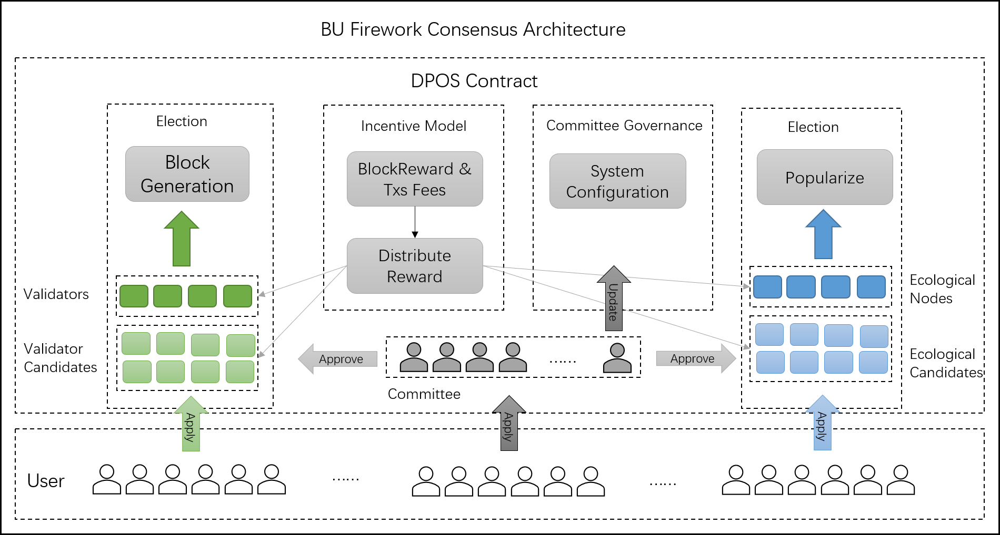
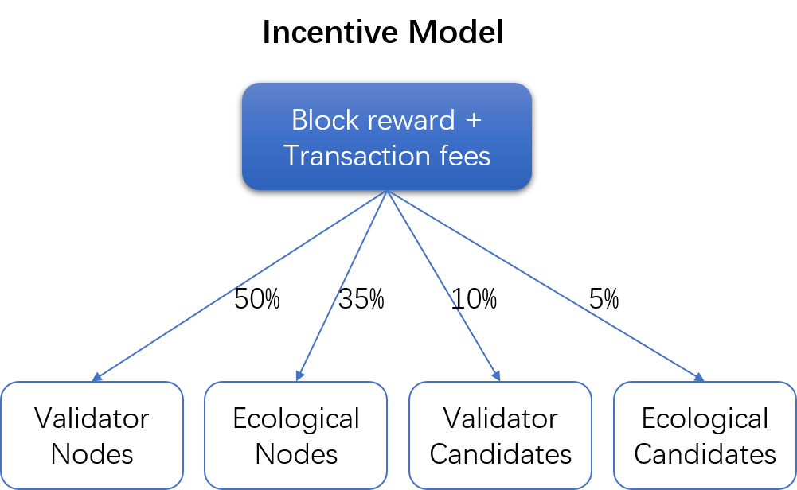

# BU Firework超级节点实时竞选系统

<!-- TOC -->

- [简介](#简介)
  - [动机和目标](#动机和目标)
  - [角色说明](#角色说明)
  - [竞选系统](#竞选系统)
- [Firework共识](#Firework共识)
  - [架构](#架构)
  - [社区治理](#社区治理)
  - [生态节点](#生态节点)
- [竞选](#竞选)
  - [准入细则](#准入细则)
  - [评估维度](#评估维度)
  - [竞选流程](#竞选流程)
  - [退出和作恶惩罚](#退出和作恶惩罚)
- [投票](#投票)
  - [投票准则](#投票准则)
  - [投票方法](#投票方法)
  - [撤销投票](#撤销投票)
- [激励模型](#激励模型)
  - [激励来源和分配](#激励来源和分配)
  - [奖励](#奖励)
  - [投票奖励](#投票奖励)
  - [节点共建以及奖励分配](#节点共建以及奖励分配)

<!-- TOC -->

## 一、简介

### 动机和目标

BU Firework使用创新的DPoS+BFT双层共识算法，支持动态的记账节点选取，具有强一致性，高容错性和高性能的特点。区别于其他牺牲了去中心化程度而获取高性能的类BFT算法，BU Firework支持动态的记账节点选取，在满足高性能要求的同时也具有很强的去中心化特征。

Bumo致力于打造价值流通基础公链网络，价值流通的基础是公平，公正，公开。为了提供安全高效的流通环境，维护交易公平，
提高Bumo公链去中心化程度，Bumo启动了超级节点计划。我们希望超级节点计划能帮助达成完善商用级基础公链以及扩大社区规模的目的。

### 角色说明

BU Firework超级节点竞选主要由三部分构成：社区治理规则，竞选系统，以及激励模型。其中包含的角色主要有：`用户，超级节点（分为记账节点、生态节点），委员会`，具体说明如下

|角色|说明|
| :----- | ------------------------ |
|用户|BU持有者，在Bumo上拥有账户，可参与竞选，投票，节点共建。|
|记账节点|Firework中参与共识、打包区块的节点，需要独立的服务器参与分布式账本记账。|
|生态节点|Firework中完善商用基础公链生态，以及促进社区良性发展的节点。|
|超级节点|记账节点和生态节点统称为超级节点，此次竞选包含记账节点和生态节点。|
|候选记账节点|通过审核的记账节点申请者，可以参与竞选，接受用户投票。|
|候选生态节点|通过审核的生态节点申请者，可以参与竞选，接受用户投票。|
|委员会|审核候选记账节点和候选生态节点的加入和退出，以及共识相关配置更改，维护共识网络和社区治理的公平，公正，无利益相关，由初始选定人员组成。|

### 竞选系统

- 区别于其他公链系统的竞选机制，BU Firework竞选机制有以下特点：

1. `保证资金安全`，记账节点资金账户地址与参与共识的记账节点地址分开，节点服务器上不保存资金相关的私钥信息，资金账户私钥无泄漏风险，保证资金安全。
2. `逻辑功能在线更新，易于维护和升级`（以delegateCall委托调用方式实现，通过更新委托调用的逻辑合约地址即可实现合约的在线升级）。
3. `逻辑结构清晰`，竞选合约负责完成超级节点竞选，竞选结果实时更新到底层共识模块，新的记账节点立即参与共识并获取奖励。
4. `低耦合的模块化设计`，Firework超级节点竞选系统主要通过`智能合约`完成，模块化实现，与其他功能模块无相互影响。

- 根据竞选相关角色的行为，竞选系统提供的功能包含：

1. `申请`，用户质押指定数量BU，申请成为超级节点（记账节点或生态节点）。
2. `审核`，委员会审核超级节点申请，作恶节点废止，共识配置更新。
3. `投票`，用户对通过审核的申请者投票（可追加）、撤销投票。
4. `退出`，用户退出候选者列表，等待冻结期后提取质押金。
5. `举报`，超级节点集合内部成员举报作恶成员，提交举报证据由委员会审核。
6. `提取`，超级节点和超级节点候选人奖励每天自动发放，也可以自己主动提取。
7. `查询`，用户查询申请，投票，废止，奖励，超级节点列表等信息。

所有规则完全公示公开，用户可以审阅合约接口文档或合约代码。

- 竞选和激励参数配置如下：

|参数|数值|
| :---------------------- | :------------------------ |
|委员会成员数目            |10|
|生态节点集合数目          |21|
|候选生态节点集合数目     |100|
|候选生态节点最小质押金额 |5000000000000 (500万BU)|
|记账节点集合数目          |19|
|候选记账节点集合数目    |100|
|候选记账节点最小质押金额|500000000000000 (500万BU)|
|审核投票通过率           |0.5 (委员会半数以上同意)|
|有效期                  | 2592000000000 (30天，单位为微秒，应用在审核有效期以及退出锁定期)|
|投票单元                | 10 0000 0000 (10BU，每次投票、追加投票或竞选者追加质押金额必须为该值的整数倍。)|
|奖励分配比|50:40:6:4 (代表记账节点集合平分区块奖励的50%，生态节点集合平分40%，记账节点候选者人集合平分6%，生态节点候选者集合平分4%)|

## Firework共识

### 架构

- 架构图如下

- BU Firework共识的特点：

> 1. 改进的DPoS+BFT共识模型
> 2. 动态投票/抽签的记账节点选取
> 3. 支持多条子链的双层共识机制
> 4. 子链记账节点的子集映射

### 生态节点

生态节点是BU Firework超级节点竞选的特色，公链平台能构建信任的基础在于足够去中心化，
去中心化又依赖于数量巨大而且足够分散的社区群体，所以如何促进生态健康发展，使其成长到足够在任意双方间都能建立信任的程度是关键。

为此Bumo提出了生态节点的概念，意在突破社区群体的数量和物理区域限制，凡是在社区发展做出贡献的用户都可以申请成为生态节点，
分享BU的成长收益。区块奖励的40%将分给生态节点，以激励生态节点持续为公链社区发展做出贡献。

### 社区治理

Bumo社区治理由初始选定的委员会组成，后续可根据社区实际发展情形，变更委员会成员。

- 当前委员会主要功能包含：

> 1. `申请审核`，审核超级节点申请并投票表决。
> 2. `配置更新提案和投票`，提议系统配置更新和投票表决。
> 3. `废止提案审核`，审核超级节点的废止提案并投票表决。

委员会对所有提案和申请审核的原则是，一人一票，支持则投票，不支持则不投票，重复投票视为一票。
在审核有效期内票数超过投票通过率（50%），则视为审核通过。如果截止到审核期结束，票数未超过投票通过率，则视为审核未通过。

## 竞选

### 准入细则

- 超级节点准入细则：

> 1. 参与超级节点的申请者至少抵押500万BU（记账节点和生态节点最少质押金均为500万BU）。
> 2. 记账节点申请者需要提供符合条件的软硬件和网络环境，生态节点申请者需提供公众影响力证明。
> 3. 申请者须填写申请材料，并保证申请材料的真实有效。

### 软硬件和网络环境要求

作为商用级基础公链，Bumo支持跨平台部署，在基于通用x86架构服务器构建的主流Window、Linux、Mac操作系统版本上运行稳定。

- 操作系统要求

|Operating System | Version |
| :------------ | ------------------------ |
| Linux |Ubuntu 14.04 or later, Centos 7 or later|
| Windows |Supports WinXP/2003/Vista/7/8/10 to building, Recommended Win10|
| Mac |MAC OS X 10.11.4 or later|

- 最低硬件要求

|Item | Value |
| :------------ | ------------ |
| CPU | 8 core|
| MEM | 32G |
| Storage |1TB SSD |
| Network |50MB |

### 评估维度

> 1. 申请材料完整度，个人和组织信誉，可信度和承诺。
> 2. 有无特殊资源，比如带宽，能源，设备成本，地域优势，设备实测性能，独特的贡献渠道。
> 3. 用户和流量资源，业务场景，技术研发实力。
> 4. 持续贡献能力，成长能力。

### 竞选流程

### 退出和作恶惩罚

- 退出

候选人可以随时申请退出超级节点竞选，申请退出不会立即退回质押金，在30天的等待期内如果没有人举报申请者作恶，再次申请即可取回质押金，进入等待期的候选人将不再参与竞选和奖励的分配。如果在等待期内有人举报该候选人作恶，将对该节点执行作恶审判。

- 作恶惩罚

如果用户在当选为超级节点之后并未作出贡献，仅是坐享其成，其他的正直的超级节点可以举报该节点，举报后经由委员会审核，如果审核通过，作恶节点的质押金将被全部扣除，目前对作恶节点质押金的处理是锁定在合约内部。

由于举报和审核的权力分置，超级节点的举报必须由超级节点提出，而举报的提案需要由委员会审核通过才能执行，举报的证据和申诉的证据均可公示给委员会和所有社区成员，委员会将结合证据和社区成员意见决定审核是否通过，所有社区成员也可监督作恶审判的过程，共同维护社区治理的公正。

## 投票

### 投票准则

> 1. 所有BU的持有者均有选举权和被选举权。
> 2. 超级节点不能在损害他人利益的情况下获得选票。
> 3. 1BU = 1选票，投票单位为10 BU，每次投票必须为10 BU的倍数。
> 4. 投票操作等于将BU东结在竞选合约账户，给候选人投多少票等于在竞选合约账户中冻结多少BU，用户可以随时通过取消投票撤回BU。
> 5. 用户可以分多次投给多个候选人，可以给某个候选人追加或撤销投票。
> 6. 候选人的质押金将以翻倍的方式计入所获票数（500万质押金=1000万票），质押金可以追加，票数越多代表所获权益越高，权益排名靠前的将成为超级节点。

### 投票方法

超级节点竞选页面提供投票结果的实时展示，用户通过竞选页面选择支持者和所投票数，然后使用小布口袋手机钱包扫码冻结BU来投票。

### 撤销投票

小布口袋手机钱包中将记录用户的投票信息，并提供撤销投票的功能，撤销投票会将投票冻结的BU退原账户，同时减少候选人票数。

## 激励模型

### 激励来源和分配

每个区块的区块奖励和交易费将通过一定的比例分配给超级节点和候选人。
当前涉及的分配角色包含记账节点和生态节点，候选记账节点和候选生态节点。比例为50:40:6:4，记账节点50%，生态节点40%，6%分给候选记账节点，4%分给候选生态节点。

- 分配模型如下图：

### 奖励

> 1. 一年的区块奖励：(365 * 24 * 3600 / 10) * 8 = 25228800 BU
> 2. 记账节点每年奖励（以19个为例）：25228800 * 0.5 / 19 = 663915.8 BU
> 3. 生态节点每年奖励（以21个为例）：25228800 * 0.4 / 21 = 480548.6 BU
> 4. 候选记账节点每年奖励（以10个为例）：25228800 * 0.06 / 10 = 151372.8 BU
> 5. 候选生态节点每年奖励（以10个为例）：25228800 * 0.04 / 10 = 100915.2 BU
> 6. 交易费用的分配随着时间的累计会不断增加，当前以太坊每日交易量约为50万笔，假设一天交易量为50万笔，按每笔交易0.0025BU的交易费计算：365 * 500000 * 0.0025 = 456250 BU， 超级节点和候选人每年将获得 456250 BU的交易费奖励。
> 7. 奖励不随代币价格而变化，区块奖励每5年衰减1/4。

### 投票奖励

超级节点候选人可以选择是否将所获奖励按一定比例分配给自己的支持者，让所有参与投票的用户在维护竞选系统稳定的同时获取一定的奖励。奖励分配比例可以根据实际情况更改。

### 节点共建以及奖励分配

Bumo提供了节点共建方案，为大多数普通用户提供了参与超级节点建设的渠道，在持有BU 不够支付超级节点质押金的情况下，用户可以选择发起节点共建申请，也可以参与其他人发起的节点共建申请，共同建设超级节点，共建节点成功后与其他参与者分享奖励。

节点共建通过单独的智能合约完成，资金存放在智能合约内部，无需转入发起人账户，保证资金安全。同时，奖励也会根据预设的分配比例和参与者持有的份额自动分配，保证公平。

- 以下是一个节点共建的流程：

> 1. 申请者向节点共建合约转入一定数量BU作为初始资金。
> 2. 申请者邀请众多好友参与或者以公开宣传的方式邀请参与者。
> 3. 资金达标后触发节点共建合约执行超节点候选人申请操作。
> 4. 申请通过后进入超级节点候选人列表接受投票。
> 5. 候选人排名靠前成为超级节点，开始履行超级节点职责并获取奖励。
> 6. 共建节点所获得的奖励按共建参与者支持的份额分配，每隔一段自动并发放到每个参与者账户。